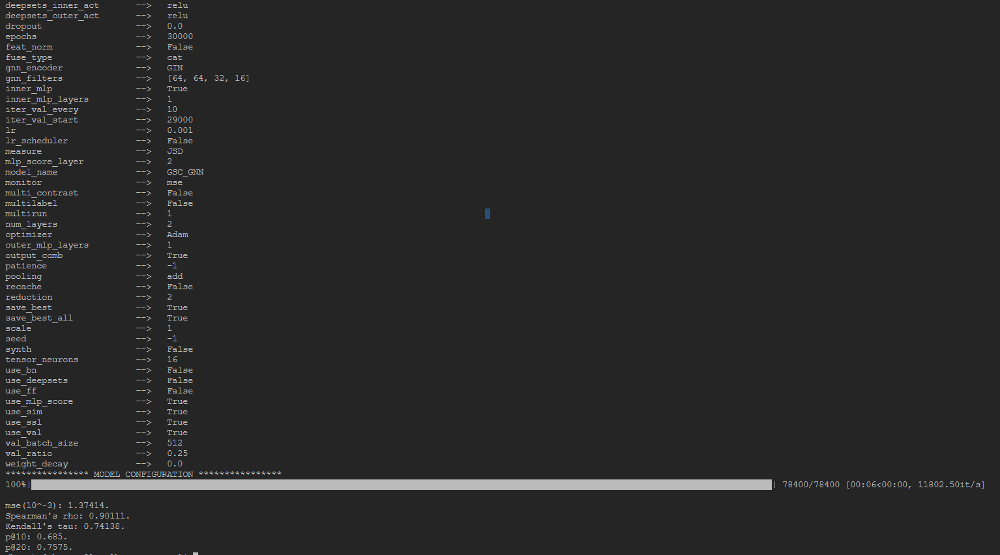

# ERIC

[NeurIPS-2022] Efficient Graph Similarity Computation with Alignment Regularization

The final version of the code is to be further cleaned.

## Requirements

```
tqdm==4.62.3
numpy==1.20.3
colour==0.1.5
seaborn==0.11.2
torch_scatter==2.0.9
networkx==2.6.3
torch_sparse==0.6.12
matplotlib==3.4.3
torch==1.10.0
gpustat==0.6.0
torch_geometric==2.0.2
scipy==1.7.2
PyYAML==6.0
rich==12.4.1
scikit_learn==1.1.0
pygraphviz
pytz
```

# Run Pretrained Model

```
python main.py --dataset AIDS700nef --run_pretrain --pretrain_path model_saved/AIDS700nef/2022-03-17_10-42-12
```

```
python main.py --dataset LINUX --run_pretrain --pretrain_path model_saved/LINUX/2022-03-20_03-01-57
```

## Running Example


